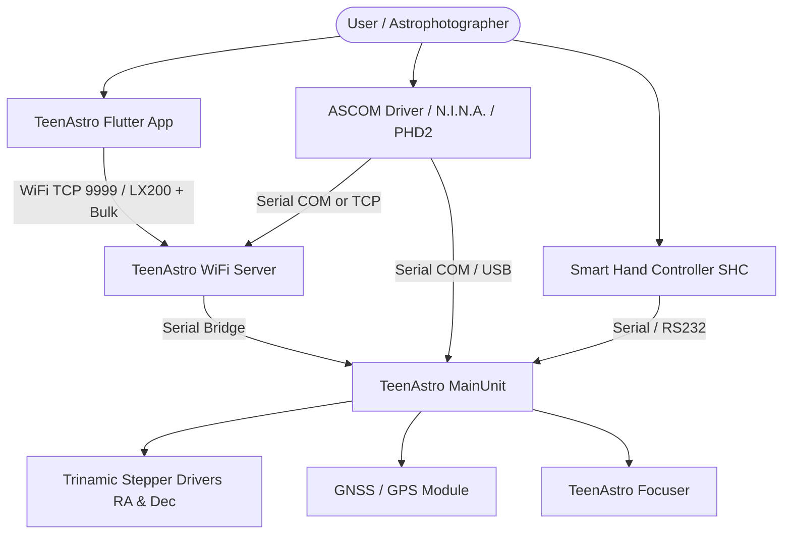

# TeenAstro – Open-Source Telescope Controller System

[](LICENSE)
[](https://platformio.org/)
[](https://groups.io/g/TeenAstro/wiki/home)

TeenAstro is a modern, modular, open-source telescope control system for amateur and semi-professional astronomy. Inspired by the legendary FS2 controller, TeenAstro provides high-precision GoTo pointing, multi-star alignment (Taki method + SVD), smooth microstepping with silent Trinamic stepper drivers (TMC2130 / TMC5160), sidereal/solar/lunar tracking, atmospheric refraction correction, WiFi connectivity, ASCOM driver support, and a cross-platform mobile/desktop control application.

---

## Key Features

- **Mount Types Supported**: German Equatorial (GEM), Fork Equatorial, Alt-Azimuth, and variations (including automatic meridian flip management).
- **Precision Astronomy Engine**:
  - Full coordinate pipeline: Equatorial (J2000 / Topocentric), Horizontal (Alt/Az), Instrument, and Local Offset coordinate systems.
  - Multi-star alignment (1, 2, or 3 stars) using Taki transformation with Singular Value Decomposition (SVD) for non-orthogonality correction.
  - High-accuracy atmospheric refraction modeling (Meeus Saemundsson / Bennett approximations).
- **Modern Hardware Architecture**:
  - **Main Unit**: Powered by 32-bit microcontrollers (PJRC Teensy 3.x / 4.x or Espressif ESP32-S3).
  - **Smart Hand Controller (SHC)**: ESP8266-based handbox with OLED graphical display (U8g2), direction buttons, multi-level menus, and built-in astronomical catalogs (Messier, NGC, IC, Caldwell, Herschel, brightest stars).
  - **WiFi Bridge & Web Server**: ESP8266/ESP32 web server providing wireless LX200 command streaming, telescope status telemetry, and web-based configuration.
  - **Motor Drivers**: Standard Step/Dir or SPI-driven Trinamic TMC2130/TMC5160 with StealthChop for silent tracking and CoolStep/SpreadCycle for high-speed slewing.
  - **Focusers & Peripherals**: Dedicated focuser controller support, GNSS (GPS) time/location synchronization, and ST4 auto-guiding input.
- **Rich Ecosystem & Control Software**:
  - **Flutter Mobile & Desktop App**: Modern touch UI for Android, iOS, Windows, and macOS with integrated planetarium, catalog navigation, alignment wizard, and real-time telemetry.
  - **ASCOM V7 Driver & Native DLL**: Fully compliant ASCOM Telescope driver for seamless integration with N.I.N.A., PHD2, Stellarium, Cartes du Ciel, SharpCap, and sequence generators.
  - **Configuration & Firmware Tools**: Windows GUI config tool, PC mount emulator, and automated firmware uploader.

---

## System Architecture



---

## Documentation Index

Comprehensive documentation is available directly within this repository:

### Core Architecture & System Guides
- [docs/README.md](docs/README.md) – Central documentation table of contents.
- [docs/overview.md](docs/overview.md) – End-to-end architecture, data flows, coordinate transformations, and hardware interactions.
- [docs/RELEASE_NOTES_SINCE_1_5.md](docs/RELEASE_NOTES_SINCE_1_5.md) – Release notes, changes, and migration history since Release 1.5.
- [VERSIONING.md](VERSIONING.md) – Firmware versioning policies (semantic release numbering guidelines).
- [docs/html/README.md](docs/html/README.md) – Local offline HTML documentation bundle.

### Mathematical Foundations & Coordinates
- [docs/math/README.md](docs/math/README.md) – Overview of linear algebra and spherical astronomy libraries.
- [docs/math/la3.md](docs/math/la3.md) – 3D linear algebra (LA3), vector operations, Euler angle extractions, and SVD.
- [docs/math/coord.md](docs/math/coord.md) – Coordinate frames (Equatorial, Horizontal, Instrument, Local Offset) and transformations.
- [docs/math/alignment.md](docs/math/alignment.md) – Multi-star alignment mathematics, Taki transformation matrices, and non-orthogonality correction.

### Firmware Subsystems
- [docs/firmware/README.md](docs/firmware/README.md) – Overview of all embedded firmware components.
- [docs/firmware/mainunit.md](docs/firmware/mainunit.md) – MainUnit state machine, sidereal clock, goto planning, and EEPROM settings.
- [docs/firmware/shc.md](docs/firmware/shc.md) – Smart Hand Controller menu structure, display driver, and keypad handling.
- [docs/firmware/server.md](docs/firmware/server.md) – WiFi server, TCP command dispatcher, and web configuration portal.
- [docs/firmware/stepper.md](docs/firmware/stepper.md) – Step/Dir generation, acceleration profiles, and Trinamic SPI configuration.
- [docs/firmware/tracking.md](docs/firmware/tracking.md) – Tracking rates (Sidereal, Lunar, Solar, King rate) and pulse guiding.
- [TeenAstroMainUnit/README.md](TeenAstroMainUnit/README.md) – MainUnit source structure and board variants.
- [TeenAstroMainUnit/Commands.md](TeenAstroMainUnit/Commands.md) – Low-level command definitions and serial handlers.
- [TeenAstroSHC/README.md](TeenAstroSHC/README.md) – Smart Hand Controller firmware configuration.
- [TeenAstroServer/README.md](TeenAstroServer/README.md) – Standalone WiFi bridge and Web UI firmware.
- [TeenAstroFocuser/README.md](TeenAstroFocuser/README.md) – Standalone electronic focuser controller firmware.
- [UniversalMainUnit/README.md](UniversalMainUnit/README.md) – Next-generation FreeRTOS-based MainUnit for Teensy and ESP32-S3.
- [UniversalMainUnit/HAL.md](UniversalMainUnit/HAL.md) – Hardware Abstraction Layer (HAL) architecture for Universal MainUnit.

### Communication Protocols
- [docs/protocol.md](docs/protocol.md) – LX200 command protocol reference, command groups, and response specifications.
- [docs/protocol-bulk.md](docs/protocol-bulk.md) – High-speed binary bulk telemetry protocol (GXAS / GXCS packets) and MountStatus structure.
- [docs/orphan_commands_gxas_gxcs.md](docs/orphan_commands_gxas_gxcs.md) – Analysis of redundant getters replaced by bulk packets.

### Applications, Drivers & Tools
- [docs/app/README.md](docs/app/README.md) – Application documentation index.
- [docs/app/overview.md](docs/app/overview.md) – Architecture and state management of the Flutter control application.
- [docs/app/planetarium.md](docs/app/planetarium.md) – Stereographic projection engine and sky map rendering layers.
- [docs/app/astro.md](docs/app/astro.md) – App-level astronomy algorithms (precession, nutation, aberration, planetary ephemerides).
- [teenastro_app/README.md](teenastro_app/README.md) – Build instructions and features for the Flutter Android/Desktop app.
- [TeenAstroConfig/README.md](TeenAstroConfig/README.md) – Windows GUI telescope and motor configuration utility.
- [TeenAstroUploader/README.md](TeenAstroUploader/README.md) – Multi-target firmware flashing tool.
- [CatalogConverter/README.md](CatalogConverter/README.md) – Tooling for converting deep-sky/star catalogs to PROGMEM tables.
- [TeenAstroEmulator/README.md](TeenAstroEmulator/README.md) – Desktop software emulator for testing without physical hardware.
- [TeenAstroEmulator/installer/README.md](TeenAstroEmulator/installer/README.md) – Emulator installation and packaging details.
- [TeenAstroASCOM_V7/TeenAstroASCOM_V7_TcpConnectivityTest/README-DriverVerification.md](TeenAstroASCOM_V7/TeenAstroASCOM_V7_TcpConnectivityTest/README-DriverVerification.md) – ASCOM V7 driver testing and conformance verification.
- [TeenAstroAscomNative/README.md](TeenAstroAscomNative/README.md) – Native C++ dynamic library for high-speed ASCOM communications.

### Core Libraries
- [libraries/README.md](libraries/README.md) – Overview of all shared and third-party libraries.
- [libraries/TeenAstroLA3/README.md](libraries/TeenAstroLA3/README.md) – 3D Linear Algebra library (vectors, matrices, SVD, refraction).
- [libraries/TeenAstroCoord/README.md](libraries/TeenAstroCoord/README.md) – Astronomical coordinate system representations.
- [libraries/TeenAstroCoordConv/README.md](libraries/TeenAstroCoordConv/README.md) – Mount alignment coordinate transformation engine.
- [libraries/TeenAstroCatalog/README.md](libraries/TeenAstroCatalog/README.md) – Compact embedded deep-sky and star catalog storage.
- [libraries/TeenAstroCommandDef/README.md](libraries/TeenAstroCommandDef/README.md) – Shared protocol opcode and packet definitions.
- [libraries/TeenAstroLX200io/README.md](libraries/TeenAstroLX200io/README.md) – LX200 command parsing and serial I/O abstraction.
- [libraries/TeenAstroMountStatus/README.md](libraries/TeenAstroMountStatus/README.md) – Mount status telemetry and bitmask definitions.
- [libraries/TeenAstroStepper/README.md](libraries/TeenAstroStepper/README.md) – Stepper motor driving and pulse generation.
- [libraries/TeenAstroWifi/README.md](libraries/TeenAstroWifi/README.md) – WiFi networking helper classes for ESP8266/ESP32.
- [libraries/TeenAstroLanguage/README.md](libraries/TeenAstroLanguage/README.md) – Multi-language internationalization strings (EN, FR, DE).
- [libraries/TeenAstroPad/README.md](libraries/TeenAstroPad/README.md) – Keypad scanning and debouncing logic.
- [libraries/TeenAstroMath/README.md](libraries/TeenAstroMath/README.md) – Common mathematical routines and trigonometry helpers.
- [libraries/TeenAstroCommandDef/README.md](libraries/TeenAstroCommandDef/README.md) – Shared protocol opcode and packet definitions.

### Build Setup, Deployment & Scripts
- [BUILD_SETUP.md](BUILD_SETUP.md) – Complete guide to setting up PlatformIO, MinGW, Flutter, and MSBuild on your PC.
- [docs/build.md](docs/build.md) – Build pipeline overview, toolchain requirements, and cross-platform notes.
- [scripts/BUILD_SCRIPTS.md](scripts/BUILD_SCRIPTS.md) – Reference of all build and automation scripts in the repository.
- [scripts/ANDROID_SETUP.md](scripts/ANDROID_SETUP.md) – Setting up the Android SDK toolchain for building the Flutter APK.
- [scripts/FIRMWARE_PUBLISH_PROCEDURE.md](scripts/FIRMWARE_PUBLISH_PROCEDURE.md) – Step-by-step firmware build and staging workflow for releases.
- [scripts/README_FIRMWARE_PUBLISH.md](scripts/README_FIRMWARE_PUBLISH.md) – Publishing firmware binaries to the TeenAstro Uploader catalog.
- [release/README.md](release/README.md) – Release binary packaging notes.

### Quality Assurance, Unit Tests & Audits
- [tests/README.md](tests/README.md) – Native desktop unit testing framework (90+ math and coordinate tests).
- [tests/conform_reproduce/README.md](tests/conform_reproduce/README.md) – ASCOM Conform test reproduction test harness.
- [tests/conform_reproduce/RA_EW_remaining_issue.md](tests/conform_reproduce/RA_EW_remaining_issue.md) – Guiding asymmetry diagnosis and resolution.
- [TeenAstroTest/README.md](TeenAstroTest/README.md) – Firmware integration test suite and test beds.
- [docs/audits.md](docs/audits.md) – Consolidated technical audits index.
- [docs/AUDIT_BUILD_AND_APP.md](docs/AUDIT_BUILD_AND_APP.md) – Build reproducibility and Flutter application audit.
- [docs/MEMORY_OVERFLOW_AUDIT.md](docs/MEMORY_OVERFLOW_AUDIT.md) – Buffer overflow and memory safety analysis.
- [docs/cockpit_pixel_audit.md](docs/cockpit_pixel_audit.md) – Hand controller OLED rendering and pixel alignment audit.

---

## Quick Start & Building

### 1. Prerequisites

- **Firmware & Native Tests**: [PlatformIO CLI or VS Code Extension](https://platformio.org/).
- **Native Unit Tests (Windows)**: MinGW GCC toolchain (`pio pkg install -g --tool "platformio/toolchain-gccmingw32"`).
- **Mobile/Desktop App**: [Flutter SDK](https://flutter.dev/).
- **ASCOM Driver & Windows Tools**: Visual Studio / MSBuild with .NET Framework 4.7.2.

For a comprehensive environment setup walkthrough, refer to [BUILD_SETUP.md](BUILD_SETUP.md).

### 2. Building Firmware

Build all firmware binaries for the primary targets from the root of the repository:

```bash
# Main Unit firmware (Teensy)
pio run -d TeenAstroMainUnit

# Smart Hand Controller firmware (ESP8266)
pio run -d TeenAstroSHC

# WiFi Server firmware (ESP8266)
pio run -d TeenAstroServer

# Focuser controller firmware
pio run -d TeenAstroFocuser

# Next-Gen Universal Main Unit (ESP32-S3 / Teensy)
pio run -d UniversalMainUnit
```

To build all 13 board variants and internationalized languages in one pass for release distribution:

```bash
python build_firmware.py
```

### 3. Running Unit Tests

Run the native desktop unit test suite (linear algebra, coordinate transformations, alignment, refraction):

```bash
# Run all test suites (91 tests)
pio test -d tests

# Run a single suite
pio test -d tests --filter test_la3
pio test -d tests --filter test_coord
pio test -d tests --filter test_coordconv
pio test -d tests --filter test_guiding_emu

# Or use the runner script
python tests/run_all_tests.py
```

See [tests/README.md](tests/README.md) for full test suite documentation.

### 4. Running the Flutter App

Requires [Flutter SDK](https://flutter.dev/):

```bash
cd teenastro_app
flutter pub get
flutter run
```

---

## Hardware Reference

TeenAstro is compatible with various hardware revisions and custom DIY builds:

| Component | Target MCU | Supported Drivers / Hardware Features |
|-----------|------------|---------------------------------------|
| **MainUnit (Classic)** | PJRC Teensy 3.2 / 3.5 / 4.0 / 4.1 (Boards 2.20–2.50) | TMC260, TMC2130, TMC5160, Step/Dir, ST4 Guide Port, GNSS (GPS) |
| **Universal MainUnit** | ESP32-S3 / Teensy 4.0 | FreeRTOS multitasking, dynamic step/dir & velocity control |
| **Smart Hand Controller** | ESP8266 / ESP-12 | U8g2 OLED (SH1106 / SSD1306), 8-key pad, multilingual menus, PROGMEM catalogs |
| **WiFi Bridge** | ESP8266 (Wemos D1 Mini) / ESP32 | SoftAP & Station mode, TCP port 9999, 115200 baud UART bridge, HTTP web portal |
| **Focuser** | Teensy 3.1 / 3.2 / LC (Boards 2.20–2.40) | TMC2130, TMC5160, Step/Dir, DS18B20 1-Wire temperature sensor, DS1302 RTC |

---

## Contributing & Development

- Contributions, bug fixes, and feature requests are welcome! Please read [CONTRIBUTING.md](CONTRIBUTING.md) for workflow details and coding standards.
- Pull request guidelines and templates: [PULL_REQUEST.md](PULL_REQUEST.md).
- Please ensure that all math unit tests pass (`pio test -d tests`) before submitting changes.
- Community discussion and support forum: [TeenAstro Groups.io](https://groups.io/g/TeenAstro/wiki/home).

---

## License

TeenAstro is released under the **GNU General Public License v3.0 (GPL-3.0)**. See [LICENSE](LICENSE) for the full license text.

