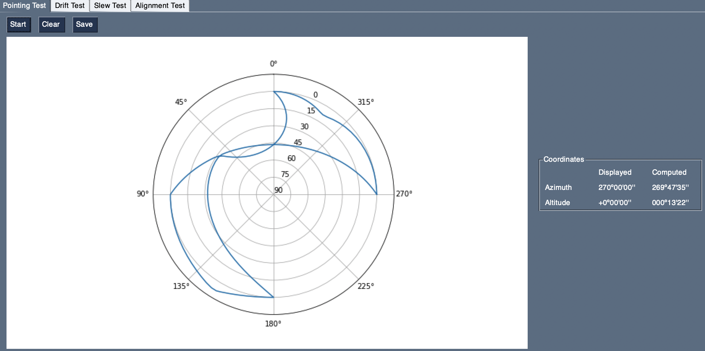
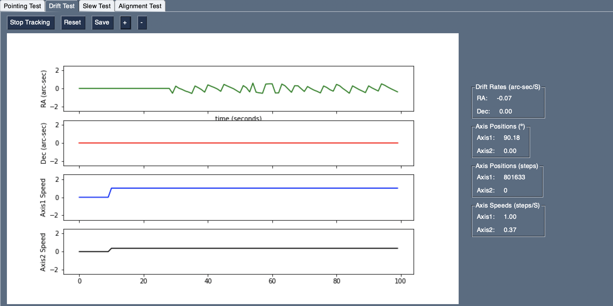
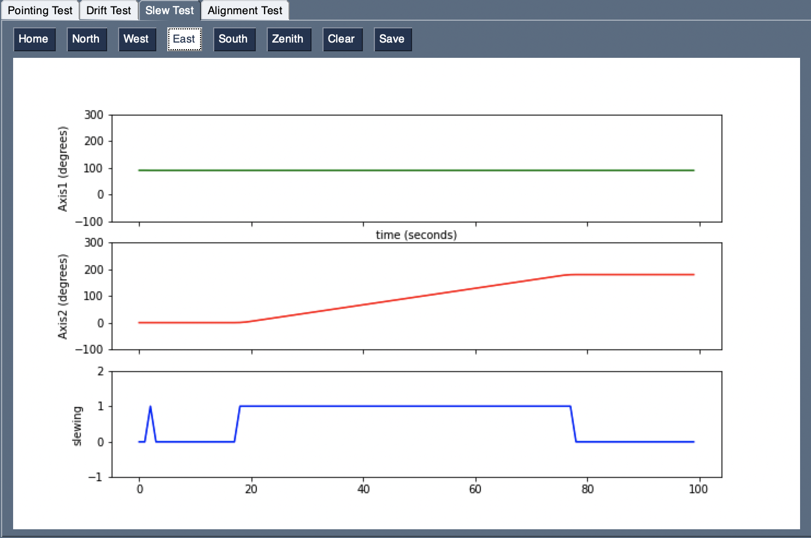
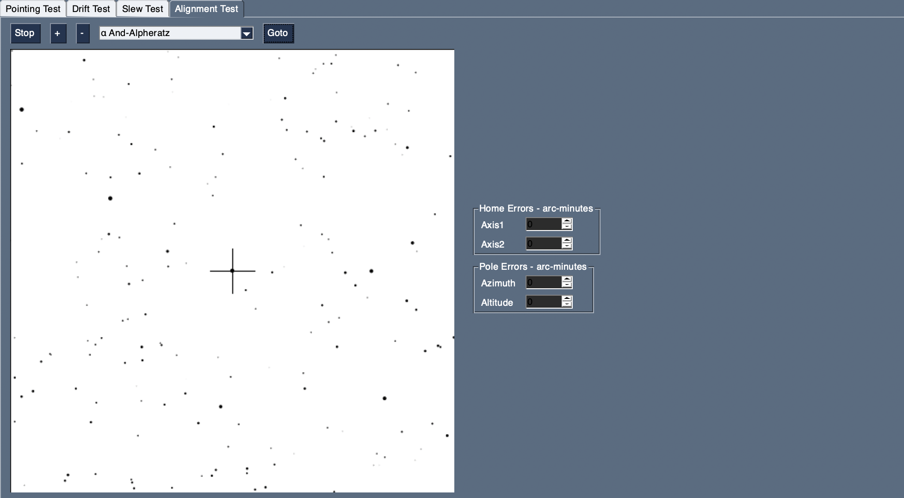

# Testing TeenAstro with AutoTest 


autoTest is a test program that compares the axis positions against values computed with the [skyfield](https://rhodesmill.org/skyfield/) astronomy library. 

```
python3 autoTest.py --help

usage: autoTest.py [-h] [-t PORTTYPE] [-p PORTNAME] [-b BAUDRATE]

The parsing commands lists.

optional arguments:
  -h, --help            show this help message and exit
  -t PORTTYPE, --portType PORTTYPE
                        TeenAstro connection type (tcp or serial)
  -p PORTNAME, --portName PORTNAME
                        TeenAstro IP address or serial port
  -b BAUDRATE, --baudRate BAUDRATE
                        TeenAstro baud rate
```


It currently has 4 test options:

- Pointing Test

The mount points to a list of positions defined as alt-az pairs. At each position, the program compares the RA / Dec reported by TeenAstro against values computed from the axis positions using Skyfield. Additionally, the positions are recorded in a polar plot.



- Drift Test 

The mount is set to track any point in the sky. At regular intervals (typically 1 second), the program reads the axis positions and computes the differences in RA and Dec since the test started. This can be used to verify slow movements like guiding and custom tracking.



- Slew Test

Allows to slew to several predefined coordinates (East, West, North, South, Zenith) and plot the axis movements against time.




- Align Test

The current TeenAstro position is plotted on top of a simple star map. A dialog box sets "home position" and "pole alignment" errors. This allows running the alignment routine in the hand controller, to view its effect on pointing accuracy.


