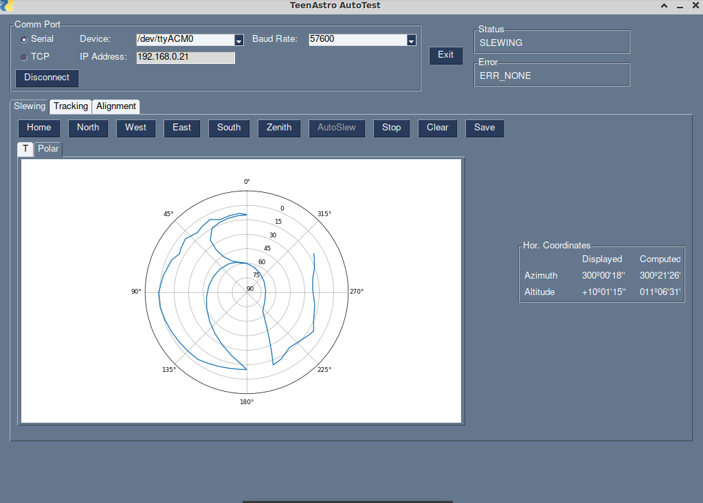
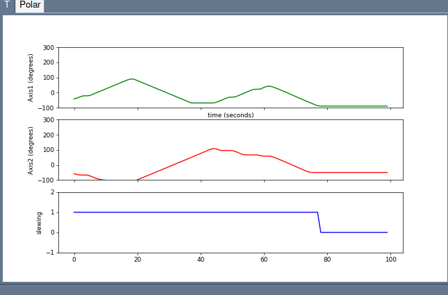
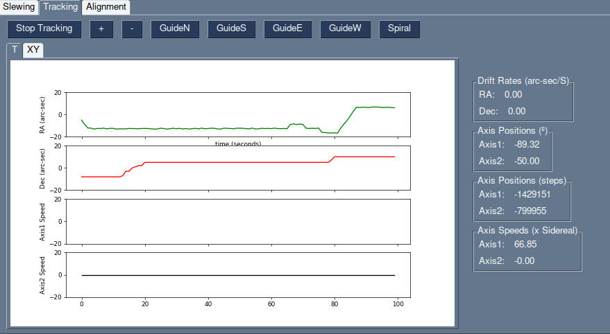
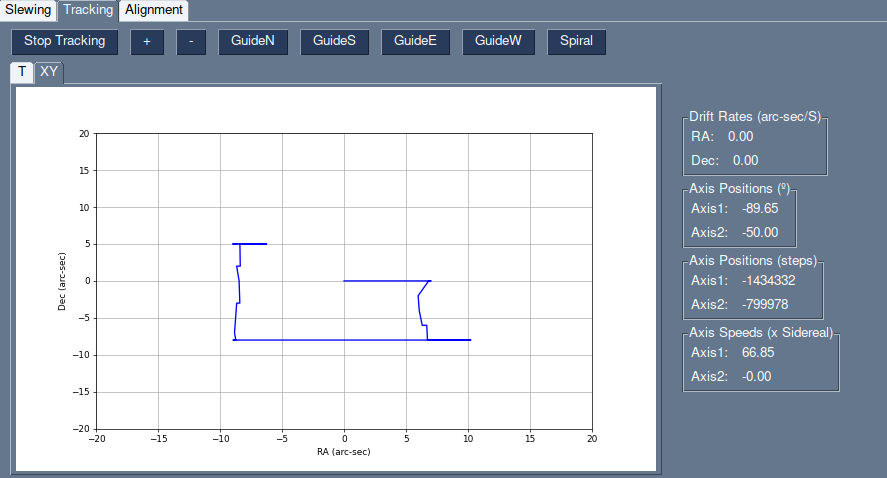
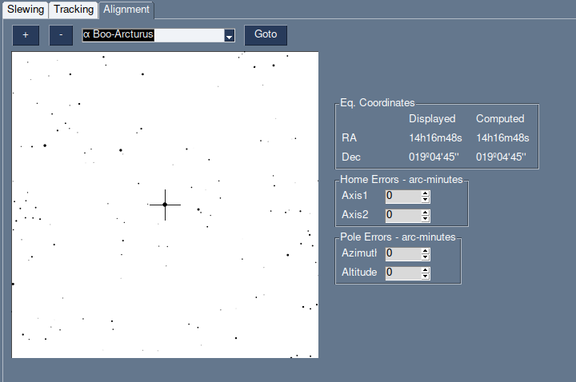

# Testing TeenAstro with AutoTest 


autoTest is a program that compares the axis positions against values computed with the [skyfield](https://rhodesmill.org/skyfield/) astronomy library. 

```
python3 autoTest.py --help

usage: autoTest.py [-h] [-t PORTTYPE] [-p PORTNAME] [-b BAUDRATE]

The parsing commands lists.

optional arguments:
  -h, --help            show this help message and exit
  -t PORTTYPE, --portType PORTTYPE
                        TeenAstro connection type (tcp or serial)
  -p PORTNAME, --portName PORTNAME
                        TeenAstro IP address or serial port
  -b BAUDRATE, --baudRate BAUDRATE
                        TeenAstro baud rate
```


It currently has 3 test options:

- Slewing

The mount points to a list of positions defined as alt-az pairs. At each position, the program compares the horizontal coordinates reported by TeenAstro against values computed from the axis positions using Skyfield. At this time, refraction is not taken into account. The positions can be displayed against time, or in a polar plot.





- Tracking 

The mount is set to track any point in the sky. At regular intervals, the program reads the axis positions and computes the differences in equatorial coordinates since the test started. This can be used to verify slow movements like guiding and custom tracking. The RA and Dec are displayed either against time, or in an XY plot. Stop and restart tracking to reset the initial position. 






- Align Test

The current TeenAstro position is plotted on top of a simple star map. A dialog box sets "home position" and "pole alignment" errors. This allows running the alignment routine in the hand controller, to view its effect on pointing accuracy.


