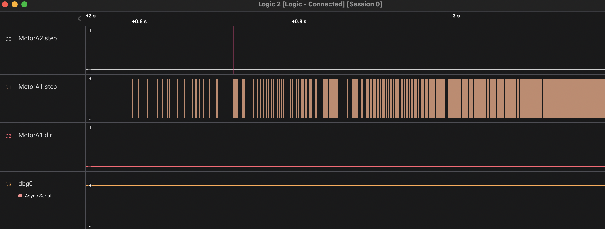
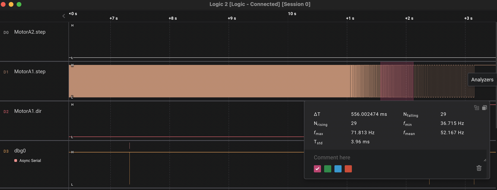

debug5160.cpp is a small monitor that allows initializing and sending commands to a TMC5160 motor driver.
It detects the SD_MODE bit (external step and dir source) and initializes either a StepDir or MotionController driver.

Refer to the [TMC5160 datasheet](https://tmc-item.chiplinkstech.com/TMC5160A_Datasheet_Rev1.14.pdf) for register description and mode of operation

Like other test programs, it is built it with platformio (pio run -t upload)

Flash it to a board (pio run -t upload), connect a terminal at 57600 bit/s and send commands

The commands are self-explanatory

| Command | Description                      | Parameters                                   |
| ------- | -------------------------------- | -------------------------------------------- |
| init    | Initialize                       | none                                         |
| custom  | Custom initialization (see code) | none                                         |
| get     | Get parameter                    | pos, target, speed, current, registers, etc. |
| set     | Set parameter                    | pos, target, vmax, amax, current etc.        |
| stop    | Stop motor                       | none                                         |

 		

Together with a logic analyzer (Saleae or clone), it can be used to debug motor driver issues.

Examples:

Accelerate

	
	Decelerate and stop
		
		
	

