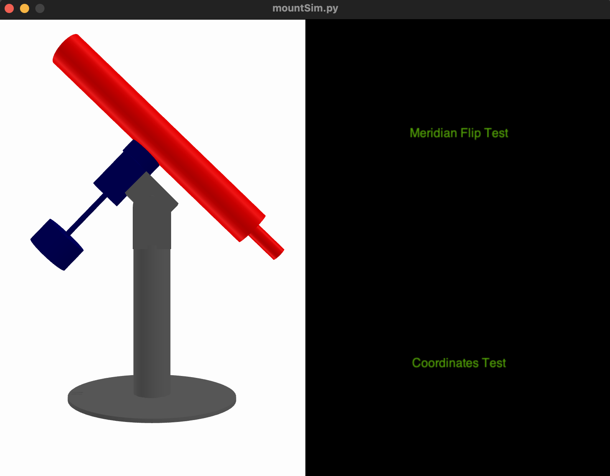

# Mount Simulator

mountSim is a Python program that connects to a TeenAstro through Wifi or serial port and displays a simulated mount. It reads the steps on both axes, and shows the mount's movements, and does a Meridian Flip (for German Equatorials only) which can help debugging eventual firmware problems. 


## Installation
Download the python scripts and STL files from Github. 
Install Python 3.8 or higher, and the following modules:

`pip install argparse numpy trimesh glooey pyglet threading serial serial.tools time datetime`

Launch mountSim from the command line as follows:

```
francois2@macMini3 mountSim % python3 mountSim.py --help
usage: mountSim.py [-h] [-t PORTTYPE] [-p PORTNAME] [-b BAUDRATE]

The parsing commands lists.

optional arguments:
  -h, --help            show this help message and exit
  -t PORTTYPE, --portType PORTTYPE
                        TeenAstro connection type (tcp or serial)
  -p PORTNAME, --portName PORTNAME
                        TeenAstro IP address or serial port
  -b BAUDRATE, --baudRate BAUDRATE
                        TeenAstro baud rate
```


A graphic window opens, that displays a simplified mount model, selected according to your type of mount, and 2 test options:

- The Coordinates test starts a sequence of Goto to 3 successive directions (North, East, South). It is trivial to add more directions by simply editing the Python code.
- The Meridian Flip test (only for GEM mounts) requests a Goto to the west limit and issues periodic Goto requests to the same RA/Dec positions, while performing guiding commands. After a few minutes the mount decides to perform the flip. 

 

There are additional commands to duplicate the handset functionality: On the keyboard, type 'e', 'w', 'n', 's' to initiate mount movements. 'q' stops the movement, 'h' requests a Goto Home.





It is also possible to control TeenAstro with the hand controller, or remotely, either with the Web interface from the SHC, or through a program running on your PC (Ekos, SkySafari etc.).   
Note that you can have only one Wifi (IP) port at a time, so the PC program should use USB, not Wifi.   
You can run mountSim in parallel with your mount, or without. In this case it is possible to speed up the maximum speed up to 2000x or more. (You may need to lower the gear reduction). 

Use these mouse movements: left-click+drag to change the view orientation, middle-click+drag to pan around.


## Program Design

The program consists of 2 python scripts (mountSim.py and teenastro.py) and STL files that represent the parts of each mount. I used the 3d parametric CAD tool [SolveSpace](https://solvespace.com/index.pl) to design the mounts. 
The display itself is done by [the trimesh library](https://trimsh.org/index.html) and a [pyglet](https://pyglet.org/) viewer.


