# TeenAstro user manual

Other languages: [français](Manuel_utilisateur_fr.md) · [Deutsch](Manuel_utilisateur_de.md)

A field manual for the mount user. It describes the hand controller, the main unit, tracking, goto, alignment, and the mechanical settings as they exist in the current firmware.

It follows the path of the Astro-Electronic FS2 manual (connections, menus, changing a value, rotation direction, speeds, goto, German mount, encoders, visitor mode), and it is based on the hand-controller menus, the main unit, and the [TeenAstro group wiki](https://groups.io/g/TeenAstro/wiki/home).

You do not need to read all of it before the first night. Chapters 3, 5, 7, and 8 are enough to start. A night on a mount that is already set up is chapter 25. The rest covers mechanical setup, a full alignment, and troubleshooting.

Menu names in bold are the labels of the English hand-controller firmware.

---

## 1. What the system is

TeenAstro is a controller for equatorial and alt-azimuth mounts. It was built by an FS2 user who wanted an open successor: the same night-time actions (hand controller, tracking, goto, sync), with stepper motors, a two-star alignment model, and a link to a computer.

| Part | Role |
|------|------|
| Main unit | Computes the sky, drives the motors, stores the mount, the time, and the site |
| Hand controller (SHC) | Display, seven buttons, catalogs, settings |
| Wi-Fi interface | Bridge between the main unit and a phone or a computer |
| Focuser | Focus motor, optional |
| TeenAstro app | Dashboard, planetarium, goto |
| ASCOM driver | Stellarium, Cartes du Ciel, and other ASCOM software |

The main unit is the only place that holds the mount position. The hand controller, Wi-Fi, and the computer send it commands and display what it answers.

Two mount parameter sets can coexist (mount 0 and mount 1). You switch sets in the Mount menu. A reboot is then required.

---

## 2. Precautions

- Do not connect or disconnect motor cables while the system is powered. Disconnecting a stepper under power can damage the driver.
- Before you change the mount type, the gear ratio, the step count, or the rotation direction, write down the values shown by **Show Settings**, or save them with TeenAstroConfig. A wrong parameter set turns a working mount into one that no longer points.
- The **Home** position at power-on is the mechanical reference. If the tube is not there, the displayed coordinates are wrong until a sync or a new alignment.
- **Visitor** mode hides the settings. Switch back to **Administrator** before a configuration session.
- A factory reset erases time, site, mechanics, and alignment. It asks for confirmation.

Supply voltage, connectors, and the schematic depend on the board (classic unit, Mini, Tiny). Wiring for each board is described in the group wiki, not in this manual.

---

## 3. The hand controller

Seven buttons: **Shift**, **North**, **South**, **East**, **West**, **F**, and **f**.

Outside a menu, North, South, East, and West move the tube. The current speed is shown by an icon at the top of the display.

| Gesture | Effect |
|---------|--------|
| Short press on Shift | Next display page |
| Shift held + East | **Telescope Action** |
| Shift held + North | **Set Speed** |
| Shift held + South | **Display** (turn off, contrast) |
| Shift held + West | **Telescope Settings** |
| Shift held + F | **Focuser Settings** |
| Shift held + f | **Focuser Action** |

Inside a menu:

| Button | Effect |
|--------|--------|
| North / South | Move up or down the list |
| West | Enter the line, or increase a value |
| East | Go back, or decrease a value |
| F | Confirm |
| f or Shift | Leave the menu |

**Ergonomics** turns the hand controller over for a left-hander: the display rotates 180° and the North/South and East/West buttons are swapped. The change takes effect after a reboot.

**Button Speed** (Slow, Medium, Fast) sets how fast a held key repeats. It does not set the mount speed.

The display dims, then sleeps, after a delay. **SHC Settings → Display** sets sleep, deep sleep, and the OLED sub-model. A press on Shift wakes the display. **Shift + South** can also turn it off at once or change the contrast (Min, Low, High, Max).

---

## 4. Reading the display

The pictures were taken from the hand-controller emulator, French firmware 1.6.7. The real display is 128×64 pixels; here it is scaled four times. An English or German build has the same layout. Only the words change, so the French text on these pictures is the French firmware, not a different screen.

### At power on

The hand controller shows the logo, then the versions, the board and the drivers, the focuser if it answers, and finally the time if no GNSS is connected.

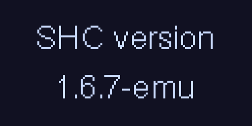

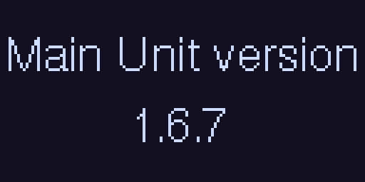

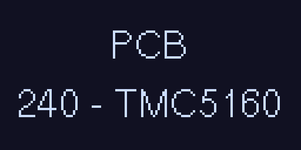

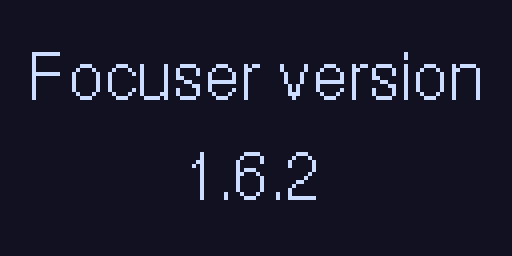

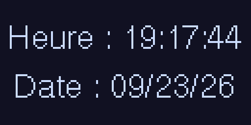

If the hand controller shows **ERROR** and **version**, its firmware and the main-unit firmware do not match. Reflash both from the same release.

If it shows **Not Connected**, the serial link to the main unit is lost. The hand controller reboots. Check the hand-controller cable before looking further.

### Pages

A short press on Shift goes to the next page. `libraries/TeenAstoCustomizations/TeenAstoCustomizations.h` decides which pages exist. As shipped, four are on: right ascension and declination, azimuth and altitude, time, and the focuser. The others appear when the matching line is uncommented (`HA_PAGE`, `PUSH_PAGE`, `AXIS_STEP_PAGE`, `AXIS_DEG_PAGE`). During an alignment, the alignment screen replaces the current page.

At home on an equatorial mount the declination is at the pole and the home icon is on.

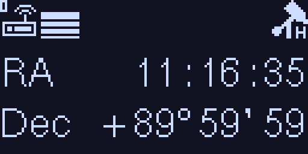

Default page. **RA** is right ascension, **Dec** is declination. Top left: Wi-Fi not linked, then the manual speed (here two bars, slow). Top right: home.

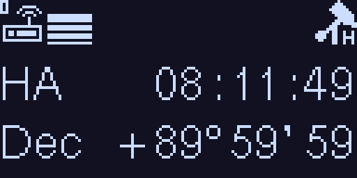

Optional page. **HA** is the hour angle, **Dec** the declination. It shows which side of the meridian the object is on.

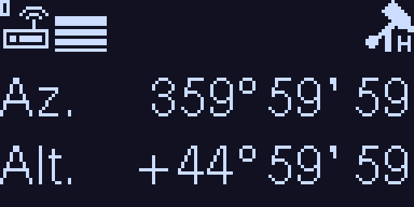

Default page. **Az.** is azimuth, **Alt.** is altitude. At an equatorial home the tube points at the pole, so the altitude depends on the site latitude.

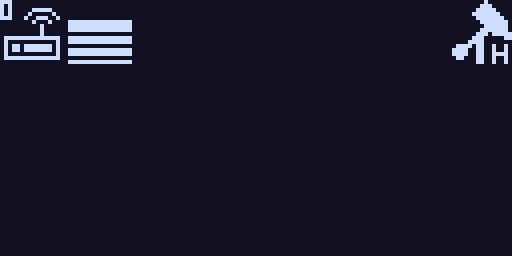

Optional page. Without encoders it stays empty: only the status row is drawn. With encoders enabled it shows the distance left on each axis to reach the target.

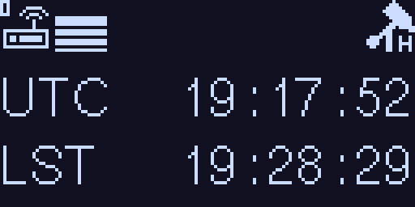

Default page. **UTC** is universal time, **LST** is local sidereal time.

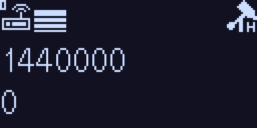

Optional page. The two numbers are the step counters of axis 1, then axis 2. They show that a motor is turning. They are not sky coordinates.

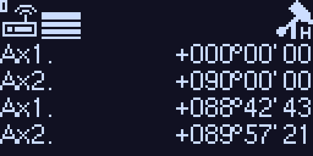

Optional page. The first pair is the motor angle of axes 1 and 2. The second pair is the same angles after correction (backlash, model). Without encoders all four lines are labelled Ax1 and Ax2.

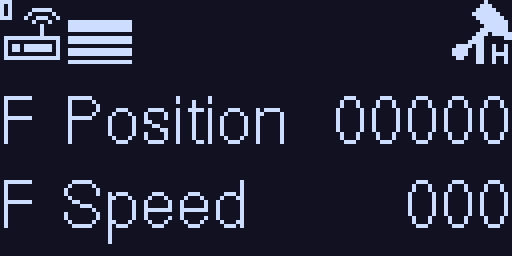

Default page when a focuser answers. **F Position** is the focus position, **F Speed** its speed. If it does not answer, the page shows **Focuser** and **Not Connected**.

### Menus

A menu opens by holding Shift, then pressing a direction. Shift or **f** leaves. East goes back. West or **F** enters the highlighted line. North and South move the highlight.

The words below are the French firmware. In English they are **Telescope Action**, **Set Speed**, **Display**, **Telescope Settings**, and **Hand Controller**.

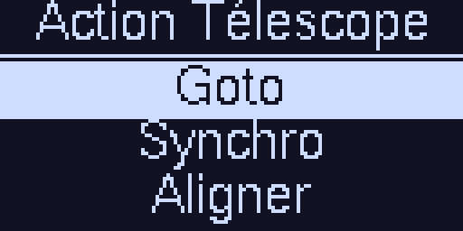

**Goto**, **Sync**, and **Align** are the first lines. The list continues with the gear check, tracking, the side of pier, saving the coordinates, the lock, and the spiral. A parked mount offers only unpark.

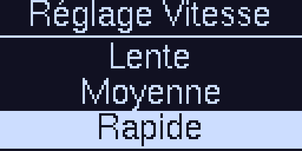

The highlighted line is the speed in use. The five steps are Guiding, Slow, Medium, Fast, and Max. The bars at the left of the main screen follow that choice: one bar for guiding, then two, three, four, and five for Max.

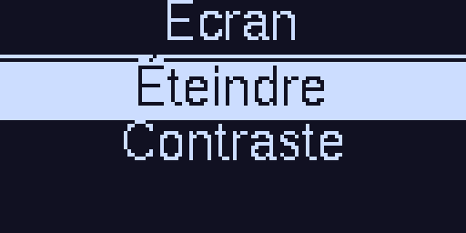

**Turn off** blanks the display at once. **Contrast** offers Min, Low, High, and Max. The OLED font does not have every accent, so a French title can lose its accent.

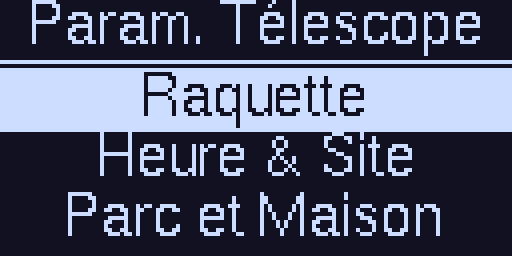

In administrator mode: **Hand Controller**, **Time & Site**, **Park & Home**, then Mount, the main-unit information, and Wi-Fi. In visitor mode this menu contains only **Rights**.

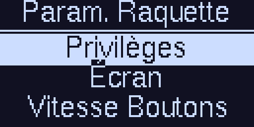

The title of this screen is **SHC Settings**. **Rights** chooses administrator or visitor. **Display** sets the dim delay, the deep sleep, and the OLED model. **Button Speed** sets how fast a held key repeats (slow, medium, fast). It does not set the mount speed. Ergonomics and the hand-controller reset follow.

### Icons

The status row is a line of 16×16 symbols. On the left: Wi-Fi, then the speed if the motors are powered, then the Shift arrow while that key is held. On the right: the mount state. Tracking, slewing, home, and park share one slot: the highest priority wins. Errors are added beside it.

**Wi-Fi.** A filled case means linked. An outline means the interface is on but has no link. The four drawings are the three station profiles (0, 1, 2) and the access point.

| Linked | Not linked | Role |
|--------|------------|------|
|  |  | Station, profile 0 |
|  |  | Station, profile 1 |
|  |  | Station, profile 2 |
|  |  | Access point |

**Manual speed.** The number of bars is the step chosen in Set Speed. The icon is drawn only while the motors are powered.

| | Step |
|---|------|
|  | Guiding |
|  | Slow |
|  | Medium |
|  | Fast |
|  | Max, the goto speed |

**Where the tube is.**

| | Meaning |
|---|--------|
| 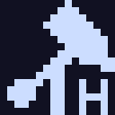 | At the home position |
|  | Parked |
|  | Parking in progress |
|  | Parking failed |
|  | Tracking stopped (two vertical bars) |
|  | Tracking on, rate not shown (triangle) |
| 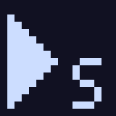 | Sidereal tracking |
|  | Solar tracking |
| 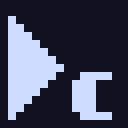 | Lunar tracking |
|  | Tracking at the object's rate (comet, drift) |
|  | Tracking with correction on right ascension only |
|  | Tracking with correction on both axes |
|  | Equatorial goto |
| 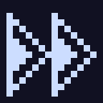 | Alt-azimuth goto |
|  | Meridian flip |
|  | A slew is in progress, type not shown |
|  | Pier side east |
|  | Pier side west |

The tracking triangle is overlaid with the star, the sun, the moon, or the target, then with a 1 or a 2 when a tracking correction is active. During a goto that triangle is replaced by the slew icon.

**Alignment, guiding, spiral.**

| | Meaning |
|---|--------|
| 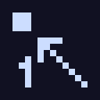 | Alignment, star 1 |
| 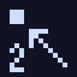 | Alignment, star 2 |
| 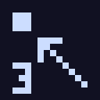 | Alignment, star 3 or later |
| 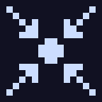 | An alignment model is stored |
|  | Spiral search running |
|  | Frame of a pulse-guide move |
|  | Pulse toward north |
|  | Pulse toward south |
|  | Pulse toward east |
| 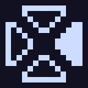 | Pulse toward west |
|  | Recentering (bullseye) |
|  | Guiding at the track rate (crosshair) |

The guide arrows are drawn on top of the frame, the bullseye, or the crosshair, depending on whether the mount is receiving an ST-4 pulse, a recenter, or a guide at the track rate.

**GNSS, lock, Shift.** The GNSS icon appears only at home or at park.

| | Meaning |
|---|--------|
|  | Time and location synchronized |
|  | Time only |
| 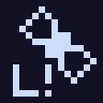 | Location only |
|  | Shift is held |
|  | Locked, without saying which |
|  | Telescope locked |
|  | Focuser locked |
|  | Telescope and focuser locked |

**Errors.** They replace the normal state on the right, or they are added next to it. The short text is what the icon itself draws.

| | Meaning |
|---|--------|
| 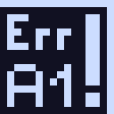 | Axis 1 limit |
| 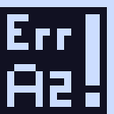 | Axis 2 limit |
|  | Below the horizon |
|  | Meridian limit |
|  | Under the pole |
| 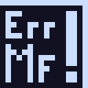 | Motor fault |

---

## 5. How to change a value

The rule is the same everywhere, as on the FS2.

1. Open the menu (usually Shift + West for settings, Shift + East for night-time actions).
2. Move down with South to the line, then enter it with West or F.
3. For a list (mount type, direction, microsteps), North and South move the highlight, F stores it.
4. For a number (gear, backlash, latitude), West increases, East decreases, F stores it. The step size is fixed for that screen.
5. **Set** confirms the write. **ERROR**, or a failed command, means the value was not stored.
6. East or f goes up one level without changing the value being edited.

Some changes require a reboot: mount type, choice of mount 0 or 1, enabling motors or encoders, ergonomics, Wi-Fi. The display then shows **Press key** / **to reboot**. Press a key and let the system restart. Do not cut power in the middle of that message.

---

## 6. First power-on

At the first power-on, the main unit assumes it is at the home position. That is not yet a mount aligned on the sky. It is only the mechanical origin.

### What to set before you point

1. **Mount type**: German Equatorial, Equatorial Fork, Altazimutal, or Altazimutal Fork.
2. The **gear**, the **steps per rotation**, and the **microsteps** of each motor (chapter 9).
3. The **rotation direction** (chapter 8).
4. The **site** (latitude, longitude, elevation) and the **time** (chapter 10).

Without site and time, sidereal tracking can still run, but equatorial coordinates and the catalogs do not match the sky.

### Default home position

- Equatorial mount: tube toward the celestial pole. On a German mount, the counterweight bar is down.
- Alt-azimuth mount: altitude 0° (tube horizontal) and azimuth 180° (tube toward the south). The base must be level.

Place the tube in that position **before** you switch on, or switch on, drive it home with the buttons, and store the position (chapter 11).

You can skip home for a first try: move the tube by hand onto an obvious object (Moon, planet, bright star), do a **Sync**, then use goto. A two-star alignment, however, starts from the home position, or from a star whose pier side you set.

### Short check suggested by the group

1. Goto **Home**, then, with the clutches loose if needed, point the tube at the pole.
2. Goto a bright star, center it, do a **Sync**.

That is enough for a visual night if the mechanical polar alignment is already good. For a model that absorbs a polar-alignment error, use the alignment in chapter 15.

---

## 7. Mount type, refraction, pole

**Telescope Settings → Mount**

| Line | Content |
|------|---------|
| Mount | Selects parameter set 0 or 1. Reboot |
| Mount type | German Equatorial, Equatorial Fork, Altazimutal, Altazimutal Fork. Reboot |
| Motors | Mechanics, speeds, tracking |
| Encoders | Position encoders |
| Limits | Horizon, zenith, axes, meridian |
| Refraction | See below |
| Reticule | Polar-finder brightness, if that output is wired |

**Refraction → Goto**: ON or OFF. When on, atmospheric refraction is included in the slew (Saemundsson on the way out, Bennett on the way back).

**Refraction → Polar Alignment** (equatorial mounts only):

- **Apparent Pole** if you use a polar finder, which shows the pole where refraction places it.
- **True Pole** if the polar alignment aims at the true polar axis, already corrected for refraction.

On an alt-azimuth mount, only goto refraction is offered: there is no mechanical pole to choose.

---

## 8. Rotation direction

Test at slow or medium speed, tube roughly at home, looking through the finder or an eyepiece.

**German equatorial**

- South must send the tube west. If it goes east, reverse axis 1, then check again.
- East must send the tube east. If not, reverse the axis that is wrong and check again.

**Equatorial fork**

- South must send the tube south. If not, reverse axis 2.
- East must send the tube east. If not, reverse axis 1.

**Alt-azimuth**: East and West command azimuth (axis 1), North and South command altitude (axis 2). The tube must move in the direction named by the button.

The setting is **Mount → Motors → Motor 1** or **Motor 2 → Rotation**: **Direct** or **Reverse**.

Axis 1 is right ascension or azimuth. Axis 2 is declination or altitude.

---

## 9. Motors, gear, current, backlash

**Mount → Motors**, with motors enabled:

Show Settings, Motor 1, Motor 2, Acceleration, Speed, Tracking, Settle Time, Disable.

**Show Settings** recalls, for each axis, the direction, the gear ratio, the steps per rotation, the microsteps, the backlash in arcseconds, and the low and high currents. Walk through those screens and write the values down before you change anything.

### Gear

This is the number of motor revolutions for one revolution of the axis, teeth included.

Example: a 360-tooth wheel and a worm, with no other reduction: gear 360. A 2:1 pulley ahead of the worm makes the gear 720. A 5:1 planetary reducer on the same axis makes it 1800.

The accepted value runs from 1 to 60000, with three decimal places. Enter the total ratio, not only the wheel tooth count, if another stage exists.

**Gear Check** (chapter 19) measures this ratio on the sky and offers a corrected value.

### Steps per rotation and microsteps

**Steps per Rot.** is the number of full steps of the motor, usually 200 or 400. The entry runs from 20 to 400.

**MicroStep**: 2, 4, 8, 16 (~256), 32, 64, 128, 256. The group most often keeps **16 (~256)** on TMC drivers: 16 real microsteps, with internal interpolation to 256. Going past 16 without a reason cuts the maximum slew speed more than it improves tracking.

### Current

**Low Curr.** is for slow speeds. **High Curr.** is for fast slews. Entry is in steps of 100 mA peak, from 200 mA to 2800 mA.

Raise the current if the motor stalls on a goto or growls under load. Lower it if the motor heats with no useful load. High current must stay within the motor and driver ratings.

### Backlash

**Backlash** is the compensation applied when the direction reverses, in arcseconds, from 0 to 999.

**Backlash Speed** sets how fast that backlash is taken up, from 16 to 64.

Set backlash only after the gear ratio and the direction are correct. Too much backlash makes the star jump at every reversal. Too little leaves a visible offset when you come back with the buttons.

### Silent mode

**Silent** ON uses the driver's quiet mode (StealthChop on TMC). OFF favors torque at high speed. If a goto stalls only in Silent, switch it OFF for the tests, raise the high current, then try Silent again.

### Acceleration

**Acceleration** is the distance, in degrees, over which the mount reaches maximum slew speed. From 0.1° to 25°. Too small a value shakes the mount. Too large a value makes every goto longer.

### Settle time

**Settle Time** is the pause at the end of a slew, before tracking resumes. It lets vibrations die down.

### Disabling the motors

**Disable** turns motor drive off and asks for a reboot. Useful when you want to move the tube by hand without fighting the holding torque. **Enable** turns them back on. While the motors are off, the menu is reduced to that single line.

---

## 10. Time, site, GNSS

**Telescope Settings → Time & Site**

### Time

- **Clock**: civil time on the display.
- **Time Zone**: offset from UTC, daylight saving included. In Central Europe: +1 h in winter, +2 h in summer.
- **Date**
- **GNSS Time**: time read from the satellite receiver, if one is fitted.

The main unit derives local sidereal time from this. A clock wrong by one minute shifts pointing by about 15' in right ascension.

### Site

Three sites can be stored.

- **Latitude**: positive in the north, negative in the south.
- **Longitude**: the sign convention is the one on the entry screen. Check the sign on a known object after the first sync. A reversed longitude is obvious: every goto lands on the opposite side in azimuth.
- **Site Elevation**: site elevation in meters. It enters the refraction calculation.
- **Select Site**: the active site.

### GNSS sync

**Sync to GNSS** copies the receiver's time and location into the main unit. With no antenna, or indoors, the display shows **NO GNSS**. An automatic sync is offered when the mount is at home or parked and the receiver has a fix.

---

## 11. Home and park

The **home position** is the origin of the axes. The **park position** is where you store the tube at the end of the night, with the motors still aware of their angle, so the sky is found again at the next power-on without a new polar alignment.

| | Home | Park |
|---|------|------|
| Role | Mechanical origin, start of alignment | Storage |
| Equatorial | Toward the pole, counterweight down on a German mount | Wherever the tube is safe |
| Default alt-azimuth | Altitude 0°, azimuth 180° (south) | Your choice |

**Telescope Settings → Park & Home**

- **Set Park**: the current position becomes park.
- **Set Home**: the current position becomes home. Use this only when the tube really is in the pose you want as the origin.
- **Reset Home**: returns to the factory home of the mount type.

**Telescope Action → Goto → Home** or **Park** sends the tube there. **Sync → Home** or **Park** declares that the tube is already there, without moving it. Reserve that for the case where you placed it by hand.

When the mount is parked, the action menu offers only **Unpark**. Unpark before any move.

The home or park icon on the right of the display confirms the state. If it is missing while the tube looks like it is at home, the stored position and the real position have diverged: either bring the tube back, or define home again.

---

## 12. Speeds

Two different places:

- **Shift + North → Set Speed** chooses the button speed for the session: Guiding, Slow, Medium, Fast, Max. The highlighted line is the active step. The bars are explained in chapter 4. The picture shows the French firmware (**Réglage Vitesse**).
- **Motors → Speed** defines what those five steps mean, plus the speed selected at power-on.

| Step | Setting | Range |
|------|---------|-------|
| Guiding | fraction of sidereal rate | 0.10× to 1.00× |
| Slow, Medium, Fast | multiple of sidereal rate | 1× to 255× |
| Max | goto speed | 60× to 3600×, in steps of 60 |
| Default Speed | step active at power-on | one of the five |

Guiding speed is also the speed of the ST-4 autoguider port.

To center a star: Fast or Medium to bring it into the finder, Slow in the eyepiece, Guiding to place it in the center without overshooting.

---

## 13. Tracking

**Telescope Action → Tracking**

If tracking is stopped, the only line is **Start Tracking**.

If it is running:

- **Stop Tracking**
- **Sidereal**: stars
- **Lunar**: the Moon
- **Solar**: the Sun
- **Target**: the stored rate for a comet or a drifting object

The rate cannot be changed during a slew. The display reports **Currently Tracking** / **cannot be changed**.

### Drift (comets, slow objects)

**Motors → Tracking → Drift Speed**

- **Right Asc.**: in seconds of time per sidereal interval (displayed unit `s/SI`), from −2 to +2.
- **Declination**: in arcseconds per sidereal interval (`"/SI`), from −2 to +2.

Set both from the ephemeris, start tracking, then choose **Target**. Switch back to Sidereal for the stars. Zero drift on both axes together with the Target rate returns to sidereal tracking.

### Refraction on tracking

**Motors → Tracking → Refraction**: ON or OFF. Separate from goto refraction. It corrects the tracking rate for the object's altitude.

### Tracking correction

**Motors → Tracking → Tracking Corr.**, on equatorial mounts:

- **Right Asc.**: alignment and refraction correction act only on the hour-angle axis.
- **Both**: both axes are corrected.

On an alt-azimuth mount the correction is always on both axes, and this line does not appear. The tracking icon changes when correction is armed (one axis, or both).

The group recommends correction on both axes once a two-star alignment has been stored, and on right ascension alone if the polar alignment is already good and you do not want declination drift introduced by the model.

---

## 14. Goto, sync, catalogs

**Shift + East → Telescope Action**, mount unparked.

| Line | Role |
|------|------|
| Goto | Slews the tube to the target |
| Pushto | Shows the direction, without motors, if encoders are enabled |
| Sync | Declares that the chosen object is in the center of the eyepiece |
| Align | Two-star model |
| Gear Check | Measures the gear ratio |
| Tracking | Starts, stops, selects the rate |
| Side of Pier | Sets the side, German mount |
| Save RADEC | Stores the current position as the user target |
| Lock | Blocks actions until Unlock |
| Spiral | Spiral search |

The **Goto** menu and the **Sync** menu offer:

Catalogs, Solar System, Coordinates, User Defined, Home, Park.

Goto adds **Flip**.

Push-to offers Catalogs, Solar System, Coordinates, and User Defined, and only if encoders are enabled. Otherwise the display shows **Encoders** / **Not Connected**.

### Solar system

Sun, Mercury, Venus, Mars, Jupiter, Saturn, Uranus, Neptune, Moon. Positions are apparent, for the current site and time.

Point at the Sun only with a suitable full-aperture filter. The controller does not know whether a filter is in place.

### Coordinates

- **J2000**: right ascension and declination of equinox 2000.0, as in most printed catalogs.
- **JNow**: apparent coordinates of the date.
- **Alt Az**: azimuth and altitude.
- **N, S, E, W**: the four cardinal points on the horizon (altitude 0°). Useful to check direction and level on an alt-azimuth mount.

The main unit applies precession, nutation, and aberration between J2000 and the date, then the equatorial-to-horizontal transform from latitude and sidereal time.

### Catalogs

The list depends on the firmware build loaded in the hand controller. In practice it includes the bright stars, Messier, and, depending on the build, NGC, IC, Caldwell, Herschel, Collinder, doubles (STF, STT), and variables (GCVS). The English firmware names the bright-star catalog "Bright Stars".

### Filters

**Goto → Catalogs → Filters**. The screen title is **FiltersAllow**. A **+** on both sides of a line means that filter is selected. **Reset Filters** clears them all.

| Line | What it keeps |
|------|----------------|
| Above Horizon | The minimum altitude. **Filter Horizon** offers **Above Horizon**, then **Above 10 deg.**, **Above 20 deg.**, and so on up to **Above 70 deg.** |
| Constellation | One constellation. **Filter by Con** starts with **All**, then the abbreviations: Her for Hercules, Lyr for Lyra, And for Andromeda, Ori for Orion |
| Type | One deep-sky type. **Filter by Type** starts with **All**. The names are those of the database: Galaxy, Globular Clstr, Planetary Nebula, Open Cluster, Nebula |
| Magnitude | The faintest magnitude still shown. **Filter Magnitude** offers **All**, then 10, 11, 12, 13, 14, 15, and 16 |

Objects already below the horizon are omitted. **Above Horizon** therefore changes little. **Above 30 deg.** keeps only targets high enough for a comfortable eyepiece, clear of trees and poor seeing.

Magnitude runs opposite to intuition: a small number is a bright object. **10** drops everything of magnitude 10 and fainter. **All** cuts nothing. Under a bright sky with a small telescope, 10 or 11 is enough. 16 is only useful if the catalog and the sky support it.

**Type** changes the list only in a deep-sky catalog (Messier, NGC, and the others). On Bright Stars it removes nothing.

If the hand controller was built with the double-star or variable catalogs, two further lines appear:

- **Dbl* Min Sep.** and **Dbl* Max Sep.**: angular separation, from 0.2" to 100". The minimum must stay below the maximum, or the screen shows **Min Sep must** / **be < Max Sep.**
- **Var* Max Per.**: maximum period, from 0.5 day to 100 days. A variable with a longer period is hidden. **Off** removes that filter.

When a filter actually removes objects, the catalog title is wrapped in exclamation marks, for example **!Goto Messier!**. If nothing remains, the screen says **No Object**: loosen one step, or **Reset Filters**.

North and South scroll the objects that remain. F starts the goto or the sync, depending on the menu you came from. A full example, M13 then M31, is in chapter 25.

### Center, then sync

1. Goto the object.
2. At the eyepiece, bring the object to the center with the buttons, slow speed then guiding.
3. **Sync** on the same object.

Sync recenters the position. It does not build the alignment model: a single object leaves the error in place as soon as you move away. For a model, use **Align**.

**Save RADEC** keeps the current coordinates. **Goto → User Defined** returns there.

### Spiral

**Spiral** asks for a field of view, from 1' to 3°. The tube draws a spiral of that diameter to find an object that landed just outside the field. A long Shift stops the motion, as for a goto.

### Lock

**Lock** reduces the action menu to **Unlock**. The direction buttons still work. Useful when you hand the controller to someone who should not start a goto.

---

## 15. Alignment

Alignment computes the transform between the sky and the axes. The method is Taki's (two measured directions), completed by the nearest proper rotation in the least-squares sense. The result is a 3×3 matrix. It is used for pointing, sync, corrected tracking, and the altitude check.

**Telescope Action → Align**

While no model is stored, on an equatorial mount:

- **2 Stars**
- **2 Stars Mech.**
- **PC Alignment**

On an alt-azimuth mount, the mechanical line is not offered.

Once a model is in place, **Save**, **Clear**, and **Show align. error** are added.

### 2 Stars, from home

1. The tube is at the home position. The display reminds you: **The mount must** be at the home position.
2. Choose **Home** when the display asks for the mode.
3. The main unit accepts the start. Pick the first star from the list (named stars, above the horizon).
4. The tube slews. **Slewing to**, then **Recenter**, is shown.
5. Center the star. A long press on Shift accepts the star (**Star added**).
6. Pick the second star, far from the first in hour angle and in declination. Same recentering, same long press.
7. On success, the model is computed. **Save** writes it to memory. Without a save it is lost at the next park or power-off, depending on whether you park: the group wiki reminds you to park at the end of the procedure to keep the result. **Save** in the Align menu does that write explicitly.

**Clear** forgets the model. The mount returns to the assumption "mechanically correct, starting from home".

### 2 Stars, from a star

If home is not reachable (the tube is already on the sky):

1. Choose **Star** instead of **Home**.
2. Set the **Side of Pier** (East or West). On a fork or an alt-azimuth mount, set the side that matches the real pose.
3. **Sync** on a centered star. That star becomes the first reference.
4. The procedure continues with the second star, as above.

### 2 Stars Mech.

Reserved for German equatorial and fork mounts. The same steps, but the calculation is forced to stay consistent with the mount's mechanical pole. Use it when polar alignment is the reference and you want a model that does not twist the pole. The start is still **Home** or **Star**.

### From a computer

**PC Alignment** waits for stars sent by the app or by software through the protocol. The display switches to **Remote Align** and shows the name of the requested star. Recentering and the long press on Shift are still done on the hand controller, at the center of the eyepiece.

### Which pair of stars

Pick two bright stars, well above the horizon, separated by at least about forty degrees, not both near the pole and not both near the horizon. One star in the east and one in the west, with different declinations, gives a stable model. Do not accept a star you are not sure of: one catalog mistake is carried across the whole sky.

**Show align. error** shows the residual angular error of the model. An error of several tens of arcminutes is a reason to repeat the procedure, not a reason to compensate with motor backlash.

### What alignment does not fix

It does not replace a wrong gear ratio, a reversed direction, or a wrong clock. If the first goto lands degrees away from the target, go back through chapters 8 to 10 before you start another alignment.

---

## 16. German equatorial mount

The tube can be on either side of the pier. The display shows the side. A goto that would cross the meridian past the limits starts a **Flip**: the tube changes side, while the object's right ascension and declination stay the same.

**Goto → Flip** requests it at once. If the arrival pose is outside the limits, the display shows **Flip** / **Not possible**.

**Side of Pier** forces East or West when the mount has lost that information (clutches loosened, tube moved by hand). The menu then asks for a sync on a target. Without it, the displayed side and the sky do not agree.

### Meridian limits

**Limits → German Equatorial**

- **Meridian E** and **Meridian W**: from −45° to +45°. They allow tracking a little past the meridian before the flip, so a exposure is not cut at the crossing.
- **Under Pole**: maximum hour angle, from 9 h to 12 h. It keeps the tube or the counterweight bar out of the tripod when you track an object under the pole.

Set these values for your mechanics (tube length, tripod height), not for the catalog. A refused object is announced as **Outside Limits**, **Below Horizon**, **Close to Zenith**, or a meridian limit.

---

## 17. Alt-azimuth mount

The base must be horizontal. A bubble level on the base is part of the setup: a two-star alignment absorbs a residual, not a base tilted by several degrees.

Default home: tube horizontal, toward the south. You can define another one with **Set Home** once the tube is in the pose you want.

Tracking corrects both axes all the time, because neither axis is parallel to the axis of the Earth. Time and site are mandatory: without them, field rotation and tracking are wrong even if the tube was synced on an object.

**Under Pole** does not apply to this mount type. The useful limits are the horizon, the zenith, and the axis stops.

Near the zenith, a small move on the sky needs a large move in azimuth. The **Overhead Limit** (next chapter) keeps the tube out of that zone.

---

## 18. Limits

**Mount → Limits**

| Line | Meaning | Entry range |
|------|---------|-------------|
| Horizon | Minimum altitude of a goto | −10° to +20° |
| Overhead | Maximum altitude | 60° to 91° |
| Axis | Mechanical stops of both axes | in degrees, after the current position is shown |
| German Equatorial | Meridian and under-pole | see chapter 16 |

**Horizon** at 0° refuses anything below the horizon. A negative value allows a slight pass below the horizon, for example from a site with a clear drop. A positive value keeps the tube above a wall or a hedge.

**Axis** first shows the position, then **Axis1 Min.**, **Axis1 Max.**, **Axis2 Min.**, **Axis2 Max.** Move the tube by hand, or slowly on the motors, against each real stop, read the angle, and pull the limit back by a degree or two so the mechanics are not hit.

A refused goto is not a fault. Read the message: **Below Horizon**, **Close to Zenith**, **Outside Limits**, declination limit, or azimuth limit.

---

## 19. Gear check

**Telescope Action → Gear Check** compares the stored gear ratio with the real motion.

The firmware asks for a sync on a star A, then a goto to B (a large move mostly on axis 1) and to C (a large move mostly on axis 2). For an equatorial mount it suggests a large hour angle, then a large declination. For an alt-azimuth mount, a large azimuth, then a large altitude.

At each arrival:

1. Wait for the end of the slew (**Waiting slew...**). A long Shift aborts.
2. Recenter the star.
3. Short press on Shift to confirm.

The display shows the error of each step, in arcminutes, and the measured gear. The formula is: measured gear = stored gear × commanded move / true move. A commanded move of less than 5° is rejected: the scale would be too poor.

If the two axes give inconsistent ratios, the display reports **Axes similar**: the chosen stars did not separate the axes enough. Start again with targets farther apart.

Copy the measured gear into **Motor → Gear** only if the rotation direction is already correct and you recentered carefully. A poorly centered star becomes a gear error directly.

---

## 20. Encoders and push-to

Encoders measure the real axis position. They are used for push-to (you push the tube, the display shows how to reach the target) and they can resync the motors.

**Mount → Encoders → Enable**, then reboot.

Then:

| Line | Role |
|------|------|
| Auto Sync | Automatic resync of the motor onto the encoder |
| Calibration | Calibration on a star |
| Pulse per deg E1 / E2 | Encoder resolution |
| Reverse E1 / E2 | Encoder direction |
| Disable | Turns the encoders off, with a reboot |

**Pulse per deg** runs from 0.50 to 3600 pulses per degree.

**Auto Sync**: Off, 60', 30', 15', 8', 4', 2', or On. The motor is resynced onto the encoder when the error exceeds the threshold, and only while not slewing. **On** resyncs continuously at the finest tolerance the firmware provides. **Off** leaves the encoders informational.

### Calibration

1. **Star**: starts the calibration.
2. Point at the reference star and center it as the display asks.
3. **Complete** stores it. **Cancel** aborts.

Each encoder's **Direct** / **Reverse** direction is set like the motors: if push-to moves away when you push in the direction shown, reverse that encoder.

### Push-to

With encoders enabled, **Telescope Action** contains **Pushto**. Choose the target as for a goto. The display switches to the distance page. Move the tube by hand until the error is gone. A short press on Shift then offers to sync the motors to the encoders.

Without encoders, that entry does not exist: the action menu is the one in chapter 14, without the Pushto line.

---

## 21. Autoguider port

The ST-4 port on the main unit receives the four directions from an autoguider or a guide camera. The speed used is the **Guiding Speed** of chapter 12.

Tracking must be running. An ST-4 correction is added to tracking; it does not replace it. The guiding state (pulse, ST-4, recenter) is visible to connected software, and the motion is visible at the eyepiece.

Set the guiding speed so that the star moves clearly on a one-second pulse, without crossing the whole sensor. 0.5× sidereal is a usual starting point. Go toward 0.3× at long focal length, and toward 0.8× if the corrections have no effect.

---

## 22. Focuser

If no focuser is connected, Shift + F or Shift + f shows **Focuser** / **Not Connected**.

**Focuser Action** (Shift + f): named positions already stored, **Goto**, **Sync**, **Park**, **Lock**. Choosing a named position sends the focuser there. **Sync** declares that the current position is the reference. **Park** sends the focuser to its park position.

**Focuser Settings** (Shift + F):

- **Config**: display, park position, maximum position, manual and goto speeds, accelerations.
- **Motor**: resolution, direction, steps per rotation, microsteps (4, 8, 16, 32, 64, 128), current.
- **Focuser Info**: version, reboot, factory reset of the focuser alone.

Locking the focuser keeps an accidental press from losing focus during an exposure.

---

## 23. Wi-Fi, phone, computer

**Telescope Settings → Wifi**

- **Turn Wifi on** or **Turn Wifi off**
- **Show Password**
- **Select Mode**: up to three station networks, plus the hand controller's access point
- **Show IP**
- **Reset to Factory** of the hand controller's Wi-Fi configuration

Turning Wi-Fi on or off requires a reboot.

In access-point mode, the phone or the computer joins the hand controller's network, with the password shown on the display. In station mode, the hand controller joins your router: the address is the one **Show IP** reports, not a fixed address.

The TCP bridge listens on port **9999** and carries the same dialogue as the main unit's USB cable. The TeenAstro app, the ASCOM driver, and planetarium software connect there.

The app provides the dashboard, the planetarium, goto, and alignment. The ASCOM driver opens TeenAstro to Stellarium, Cartes du Ciel, NINA, and other ASCOM clients on Windows.

A web page on the interface lets you enter networks and the password without using the hand controller. The address is the one shown by **Show IP**.

### SkySafari

You need SkySafari Plus or Pro, the edition that drives a telescope. The phone and the hand controller must be on the same network.

In access-point mode, as shipped: the network name is **TeenAstro**, the address is **192.168.0.1**, the port is **9999**. The factory password is `password`; **Show Password** displays the one actually stored, if it was changed. In station mode the phone is on your router and the address is the one from **Show IP**, still on port 9999.

In SkySafari: Settings, Telescope, Setup.

| Setting | Value |
|---------|--------|
| Mount type | Equatorial GoTo, or Alt-Az GoTo, matching the mount |
| Scope type | Meade LX-200 Classic |
| Connection | Wi-Fi. Not the SkyFi mode |
| Address | 192.168.0.1 in access-point mode, otherwise the **Show IP** address |
| Port | 9999 |

**Set Time & Location**, if offered, sends the phone's clock, and the site only while the mount is at home or parked. If time and site are already right on the hand controller, leave that box off: the phone would overwrite the site. If you do want the phone's GPS, park first, or be at home, then enable the box and connect.

Connect. The chart should show the telescope crosshair. Tap an object, then Goto. The hand controller shows the slew icon. One goto at a time: SkySafari's and the hand controller's interrupt each other.

Recentering is still done with the buttons, slow speed then guiding. Sync can come from SkySafari or from the hand controller, on the same object. The two-star alignment of chapter 15 stays simpler on the hand controller; SkySafari is for choosing objects afterwards.

While a computer commands the mount, the hand controller remains usable. Avoid starting two gotos at once: the second one interrupts the first.

### Firmware update

The group wiki describes TeenAstroUploader for Windows.

1. Save the parameters with TeenAstroConfig before an update. A version change can reset memory if the internal key has changed.
2. USB cable on the main-unit port only, mount powered. The first time, Windows installs the Teensy device.
3. In the tool, select the board. The fourth screen after power-on shows the model. If in doubt, read the marking on the board.
4. Start the upload and wait for the loader to finish.
5. For the hand controller over Wi-Fi: read the address with **Show IP**, enter it in the tool, upload over Wi-Fi.

The hand controller and the main unit must come from the same release. Otherwise the version-error screen returns at startup.

**Main Unit Info → Show Version** shows the firmware name and date. **Reboot** restarts the unit. **Reset to Factory** erases memory after a NO / YES confirmation.

---

## 24. Visitor mode

**SHC Settings → Rights**: **Administrator** or **Visitor**.

In visitor mode, **Telescope Settings** contains only **Rights**. Mechanical, time, and Wi-Fi settings are hidden. Night-time actions (goto, sync, tracking, speeds) remain available. This is the mode to leave on a shared mount or during a demonstration.

The choice is stored in the hand controller. To return to administrator: Shift + West, **Rights**, **Administrator**.

---

## 25. An observing night

The example is a late-summer evening around 45° north: Vega and Altair are high, M13 is still up, M31 is rising. On another night, keep the same actions and change the names. Filters are in chapter 14, SkySafari in chapter 23.

### Telling that the battery is empty

The hand controller has no gauge. Nothing on the screen says "battery low". You see it in the behaviour, and with a check before the night.

Before power-on, a voltmeter on the battery is the only reliable number. The exact threshold depends on the chemistry (lead or lithium) and on the board: the group wiki gives the voltage for your version. A battery that holds at rest and sags as soon as a motor accelerates is already too weak.

During the session, a failing battery looks like this, while the cables have not moved:

- the display dims, flickers, or the hand controller restarts on its own at the logo;
- **Not Connected**, then a reboot, without anyone touching the cable;
- a goto at Max speed stalls, the motor growls, the tube stops short of the object, and the same move at slow speed succeeds;
- Wi-Fi disappears and **Show IP** no longer answers until the next start;
- tracking stops and the coordinates no longer match the sky, because the main unit restarted and lost its place.

These are not an empty battery: a black screen that Shift wakes is the sleep timeout; **ERROR** / **version** is firmware that does not match.

If the signs appear during a goto, stop the motion (long Shift). Park only if the motors still answer. Recharge or swap the battery before going on: lost steps make the pointing wrong until a new sync.

### Starting up

1. Tube at the park position, or at home if you have not defined a park yet. Connect, power on, let the logo, the versions, and the time go by.
2. Check the time and the site (**Time & Site**). Without GNSS, those are the values you entered.
3. If the tracking icon is absent: **Telescope Action → Tracking → Start Tracking**.
4. If the action menu offers only **Unpark**, the mount is parked. Unpark. The park icon must go away.

### Align on two stars

If a model already exists and the polar alignment has not moved: **Goto → Catalogs → Bright Stars**, choose Vega, center at slow speed, and sync only if the star entered the field. Then go on to the objects.

Otherwise, a two-star alignment from home (chapter 15), with two named stars, high, and far apart:

1. First star: Vega, in Lyra. The tube moves, the screen says **Slewing to** then **Recenter**. Center it. A long press on Shift: **Star added**.
2. Second star: Altair, in Aquila. It is far from Vega in hour angle. Same recentering, same long press.
3. **Save**. The alignment icon confirms that the model is stored.

A pair that is too close, Vega and Deneb for example, gives a weak model. Chapter 15 explains how to choose.

### First object: M13

M13 is the Hercules globular cluster, easy in a finder once the model is in place.

1. **Goto → Catalogs → Filters**.
2. **Above Horizon**, then **Above 30 deg.** M13 should be well up; if the filter removes it, that is the right outcome.
3. **Constellation**, then **Her**.
4. **Type**, then **Globular Clstr**.
5. Back to the catalogs, open Messier. The title becomes **!Goto Messier!**: the filters are working. Scroll to M13. F starts the goto.
6. On arrival, **Slow** in the finder, **Guiding** in the eyepiece. Sync only if you are sure the cluster is centered. A sync on the wrong object shifts the whole sky.

If the screen says **No Object**, M13 is below 30° or the type does not match. **Reset Filters**, then try again with **Above 10 deg.**

### Second object: M31

M31, the Andromeda galaxy, is not in Hercules. Leave the constellation filter unchanged and it will not appear.

1. **Filters → Constellation → And**.
2. **Type → Galaxy**. Leave the altitude at 30° if Andromeda is already up, otherwise drop to **Above 10 deg.**
3. Messier, M31, F.
4. The field is wide: slow speed, and the finder rather than high power, to pick it up.

For a planetary nebula in the same part of the sky as Vega: **Constellation → Lyr**, **Type → Planetary Nebula**, then M57.

The Moon, Jupiter, or Saturn go through **Goto → Solar System**, with no filter. The Sun only with a full-aperture filter on the tube. The controller does not check that.

### End of the night

**Goto → Park**. Wait for the park icon, not merely for the motors to stop. Then switch the power off. An interrupted park leaves the position wrong at the next start.

If you loosened the clutches during the night, do at least a sync again, and an alignment if the tube moved a long way without the encoders following.

---

## 26. When something is wrong

| What you see | Where to look |
|--------------|----------------|
| **ERROR** / **version** | Hand controller and main unit from different releases |
| **Not Connected**, then a reboot | Hand-controller cable, a battery sagging under load, or the main unit off |
| The display dims, the hand controller restarts at the logo, a Max-speed goto stalls | Battery empty or too weak under load. The hand controller does not show voltage. Chapter 25 |
| Black screen, Shift wakes it | Sleep timeout, not an empty battery |
| The buttons move the wrong way | Chapter 8, rotation direction |
| Goto is always off by a factor of two or more | Gear ratio or step count. Run a gear check |
| Goto is good near the sync star and worse farther away | No alignment, or the wrong star. Wrong time or longitude |
| **Below Horizon** or **Outside Limits** on an object that is visible | Horizon limit, wrong site, or wrong pier side |
| **Close to Zenith** | Overhead limit, or the object really is too high for the mechanics |
| The motor stalls on a goto | High current too low, Silent, acceleration too sharp, max speed too high |
| The motor heats while idle | Low current too high |
| The star jumps at every button reversal | Backlash too large, or backlash at zero while the mechanics have some |
| Alignment fails immediately | The mount was not at home, or the first sync was rejected |
| **Flip** / **Not possible** | The arrival pose would cross a meridian or axis limit |
| Push-to moves away from the target | Encoder direction reversed, or wrong pulses per degree |
| Wi-Fi shows no address | Wi-Fi off, wrong mode, or the reboot has not happened yet |

Before you erase memory: write the parameters down, or reopen the TeenAstroConfig backup. A factory reset is the last resort, not the first.

---

## Appendix A. Menu tree

Lines in parentheses appear only in the case indicated.

**Shift + East — Telescope Action**

- (if parked) Unpark
- Goto — Catalogs, Solar System, Coordinates, User Defined, Home, Park, Flip
- (encoders) Pushto — Catalogs, Solar System, Coordinates, User Defined
- Sync — same as goto, without Flip
- Align — 2 Stars, (equatorial) 2 Stars Mech., PC Alignment, then Save, Clear, Show align. error
- Gear Check
- Tracking
- Side of Pier
- Save RADEC
- Lock
- Spiral

**Shift + North — Set Speed**: Guiding, Slow, Medium, Fast, Max

**Shift + West — Telescope Settings** (administrator)

- Hand Controller — Rights, Display, Button Speed, Ergonomics, Reset
- Time & Site — Time (Clock, Time Zone, Date, GNSS Time), Site, Sync to GNSS
- Park & Home — Set Park, Set Home, Reset Home
- Mount — Mount, Mount type, Motors, Encoders, Limits, Refraction, Reticule
- Main Unit Info — Show Version, Reboot, Reset to Factory
- Wifi

**Motors → Motor 1 or 2**: Show Settings, Rotation, Gear, Steps per Rot., MicroStep, Backlash, Backlash Speed, Low Curr., High Curr., Silent

---

## Appendix B. Greek letters

Star catalogs use Bayer letters. The English firmware names the catalog "Bright Stars".

| Letter | Name | Letter | Name |
|--------|------|--------|------|
| α | alpha | ν | nu |
| β | beta | ξ | xi |
| γ | gamma | ο | omicron |
| δ | delta | π | pi |
| ε | epsilon | ρ | rho |
| ζ | zeta | σ | sigma |
| η | eta | τ | tau |
| θ | theta | υ | upsilon |
| ι | iota | φ | phi |
| κ | kappa | χ | chi |
| λ | lambda | ψ | psi |
| μ | mu | ω | omega |

A few proper names that often appear in that catalog: Sirius, Canopus, Arcturus, Vega, Capella, Rigel, Procyon, Betelgeuse, Altair, Aldebaran, Spica, Antares, Pollux, Deneb, Regulus.

For alignment, a named star high in the sky is worth more than a faint star you are not sure of.

---

## Appendix C. Computing the gear ratio

Gear = (wheel teeth) × (ratio of every reducer or pulley ahead of it).

| Arrangement | Calculation | Value to enter |
|-------------|-------------|----------------|
| Worm, 360-tooth wheel, motor direct | 360 × 1 | 360 |
| 180-tooth wheel, 16/8 pulley | 180 × 2 | 360 |
| 144-tooth wheel, 10:1 reducer | 144 × 10 | 1440 |
| 360-tooth ring, stages 3:1 and 2:1 | 360 × 3 × 2 | 2160 |

Steps per rotation are those of the bare motor (200 for 1.8°, 400 for 0.9°), not the product with the microsteps. Microsteps are set separately.

Approximate sky resolution, in arcseconds per microstep:

360 × 3600 / (gear × steps per rotation × microsteps)

Example: gear 360, 200-step motor, 16 microsteps → 11.25" per microstep. That is the order of magnitude of the smallest move, before driver interpolation. It is not the pointing accuracy, which depends on backlash, flexure, and alignment.

---

## Appendix D. Where to go next

- Group and wiki: [https://groups.io/g/TeenAstro/wiki/home](https://groups.io/g/TeenAstro/wiki/home). First run, illustrated menus, boards, the backup tool, and the flashing procedure are there.
- Technical documentation in the repository: [docs/README.md](../README.md) (architecture, tracking, protocol). It is for people who change the software, not for running a night.
- FS2 manual, for the original approach: [anleit_f.pdf](https://www.astro-electronic.de/anleit_f.pdf) (French) and the German edition on the same site, Astro-Electronic, Michael Koch.

Boards, supply voltages, and motor harnesses are not the same from one version to the next. For wiring, start from your board's page in the wiki, then come back here for use.
