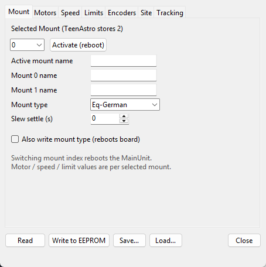
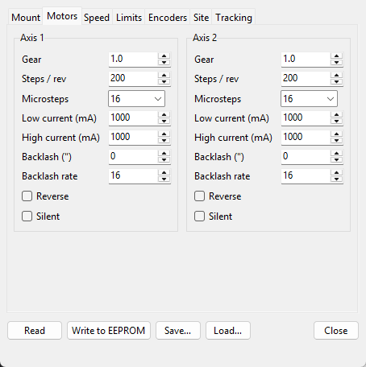

# TeenAstroUploader — Auto! and EEPROM

> Groups.io: https://groups.io/g/TeenAstro/wiki/10404  
> (replaces the old TeenAstroConfig wiki page)

Firmware **1.5 or newer**. Older branches are not supported for backup/restore — use **Upload!** only after saving settings another way.

## Auto!

On the Telescope or Focuser tab: detect board → backup parameters to JSON → flash → restore after reboot → verify.

TeenAstro stores **two mounts** (0 and 1); Auto! works on the **active** mount.

## EEPROM editor

Same groups as the Webserver: Mount, Motors, Speed, Limits, Encoders, Site, Tracking.

- **Read** / **Write to EEPROM** — after Write, values are re-read and checked  
- **Save…** / **Load…** — JSON under `%LocalAppData%\TeenAstro\Config\` by default  
- **Activate (reboot)** — switch between the two stored mounts  

## Legacy: TeenAstroConfig.exe

Jürgen Goldan’s TeenAstroConfig.exe remains available if you already use its files. For new setups on 1.5+, prefer Auto! / EEPROM in the Uploader.
