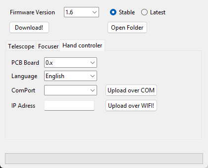

# TeenAstroUploader — Hand controller

> Groups.io: https://groups.io/g/TeenAstro/wiki/43072

## First flash over COM

Power off, remove the Wemos ESP8266 (or use your board’s programming cable), connect micro‑USB. Select **ComPort**, then **Upload over COM!**.

## Later updates over Wi‑Fi

Power on, join TeenAstro Wi‑Fi. IP: **Telescope Settings → Wifi → Show IP**. Enter **IP Adress**, then **Upload over WIFI!**.

You can also use the Webserver **Update Firmware** with `TeenAstroSHC_*.bin` from the downloaded folder.

Hub: [TeenAstroUploader for Windows](TeenAstroUploader_for_Windows.md).
