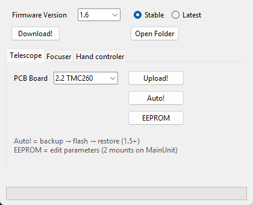

# TeenAstroUploader — Telescope

> Groups.io: https://groups.io/g/TeenAstro/wiki/43070

Connect USB to the **Telescope** port only and power on. The first time, Windows installs the Teensy driver (Teensyduino RawHID).

| Button | What it does |
|--------|----------------|
| **Upload!** | Flash the selected PCB only. Use on firmware older than 1.5, or when settings were saved another way. |
| **Auto!** | Backup → flash → restore → verify. Needs **1.5+**. See [Auto! and EEPROM](TeenAstroUploader_Auto_EEPROM.md). |
| **EEPROM** | Full parameter editor. See [Auto! and EEPROM](TeenAstroUploader_Auto_EEPROM.md). |

Hub: [TeenAstroUploader for Windows](TeenAstroUploader_for_Windows.md).
